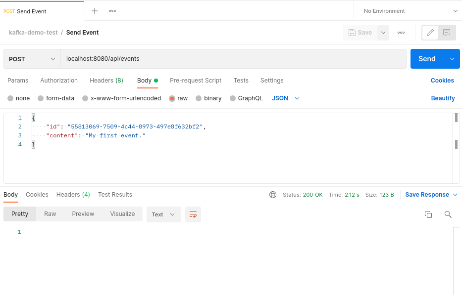

# Getting Started

### Reference Documentation
For further reference, please consider the following sections:

* [Official Gradle documentation](https://docs.gradle.org)
* [Spring Boot Gradle Plugin Reference Guide](https://docs.spring.io/spring-boot/docs/2.6.7/gradle-plugin/reference/html/)
* [Create an OCI image](https://docs.spring.io/spring-boot/docs/2.6.7/gradle-plugin/reference/html/#build-image)
* [Spring for Apache Kafka](https://docs.spring.io/spring-boot/docs/2.6.7/reference/htmlsingle/#boot-features-kafka)

### Additional Links
These additional references should also help you:

* [Gradle Build Scans – insights for your project's build](https://scans.gradle.com#gradle)

## Kafka-Demo

This project is a simple Kotlin demo for a Kafka Producer and a Kafka Consumer for a simple Event object. The project structure 
has a config package for spring beans, a package to define a model for an Event object, the producer and the consumer, and a 
simple RESTful endpoint to trigger the creation of the Event.


To allow the bootstrap of the project easier the kotlin application and the kafka environment were organized inside a docker-compose
file. This docker-compose contains the Zookeeper the Kafka depends, the Kafka itself, and the Kotlin application. To allow the creation
of the topic used by the application it was created also a temporary image just to connect to the kafka service and
create it. The application image was created with a layer for the application build and another layer for the application itself.
This is the view of the services:


### Running the example

To make all the process easier the application image already builds the Spring application. When running the docker-compose the build of the image it triggers
all the stack with all its configurations. To avoid problems in case of experimenting modifications on the default project codebase it is recommended to use the
flag "--build" when running the "docker-compose up". After the project checkout it is just to run on its root folder the following command:

```shell
sudo docker-compose up --build
```

After that the application is running, and it will be possible to check the whole docker compose containers running:

```shell
sudo docker-compose ps

         Name                      Command            State                               Ports                            
---------------------------------------------------------------------------------------------------------------------------
kafka-demo_init-kafka_1   /bin/sh -c                  Exit 0                                                               
                          # blocks until ...                                                                               
kafka-demo_kafka-demo_1   java -jar kafka-demo.jar    Up       0.0.0.0:8080->8080/tcp,:::8080->8080/tcp                    
kafka-demo_kafka_1        /etc/confluent/docker/run   Up       0.0.0.0:29092->29092/tcp,:::29092->29092/tcp, 9092/tcp      
kafka-demo_zookeeper_1    /etc/confluent/docker/run   Up       0.0.0.0:2181->2181/tcp,:::2181->2181/tcp, 2888/tcp, 3888/tcp
```

Once the list of services for the docker compose stack is visible it is possible to connect to the application container and follow the logging files:

```shell
sudo docker exec -ti kafka-demo_kafka-demo_1 /bin/bash
root@a7ef6177d02e:/app# ls
kafka-demo.jar	spring.log
root@a7ef6177d02e:/app# tail -f spring.log 
```

Once we are tracking the application logging files it will be possible to see the logs for Events sent and received. 

### Testing Event Send/Receive

Now it is possible to say that the docker compose-stack is up and running, and that it is possible to track the behavior for the Spring application.
To check the behavior of the producer and the consumer the example will send an Event message to the application topic. In this process it will be 
possible to check on the logs the message being produced and the message being consumed. Through a Postman collection it will be sent to the topic
an Event. Based on this the application steps will show us how this flow works:



After sending the RESTful event on Postman we can check the logs on the application for the Event producing and consuming:

```shell
2022-04-23 00:59:18.684  INFO 1 --- [http-nio-8080-exec-5] c.t.kafkademo.kafka.EventProducer        : send message: Event(id=55813069-7509-4c44-8973-497e8f632bf2, content=My first event.)
2022-04-23 00:59:18.686  INFO 1 --- [kafka-producer-network-thread | producer-1] org.apache.kafka.clients.Metadata        : [Producer clientId=producer-1] Resetting the last seen epoch of partition simple-event-topic-0 to 0 since the associated topicId changed from null to bS3JLuyFTGCAHw9TP_RhKw
2022-04-23 00:59:18.689  INFO 1 --- [http-nio-8080-exec-5] c.t.kafkademo.config.EventSerializer     : Serializing...
2022-04-23 00:59:18.726  INFO 1 --- [org.springframework.kafka.KafkaListenerEndpointContainer#0-0-C-1] c.t.kafkademo.config.EventDeserializer   : Deserializing...
2022-04-23 00:59:18.727  INFO 1 --- [org.springframework.kafka.KafkaListenerEndpointContainer#0-0-C-1] c.t.kafkademo.kafka.EventConsumer        : got message: Event(id=55813069-7509-4c44-8973-497e8f632bf2, content=My first event.) 
```

## Final Considerations

The event driven approach has being much used lately. Understand its mechanisms will help to reason about the drawbacks and advantages
of bringing this approach to your solution. Getting to practice the  scenarios of and event drive approach will help to understand if the scenarios
fit into the needs your problem need to solve. Probably try some case scenarios will help to understand if it is the way.